# Asynchronous family
 
## Asynchronous Advantage Actor-Critic (A3C)

Asynchronous Methods for Deep Reinforcement Learning. [[arxiv '16]](http://arxiv.org/abs/1602.01783)

- RMSProp with shared stats (i.e. moving average of squared gradient), updated asynchronously and without locking.
- One can explicitly use different exploration policies in each actor-learner to maximize this diversity. Thus, we do not use a replay memory and rely on parallel actors employing different exploration policies to perform the stabilizing role undertaken by experience replay in the DQN training algorithm.

### Vanilla A3C

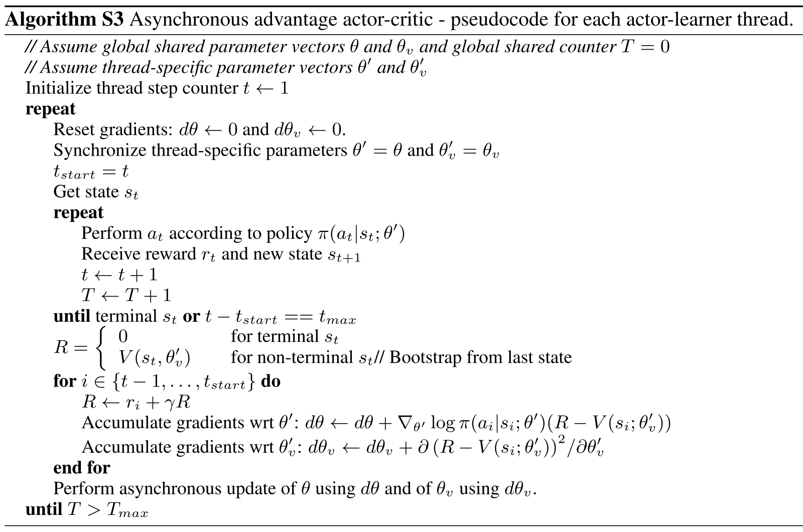

### Async baselines

One-step Q
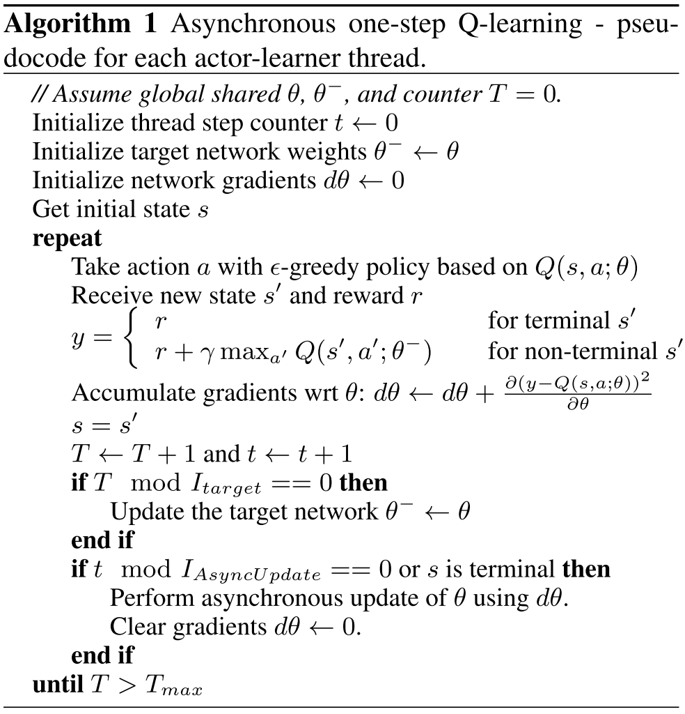

N-step Q
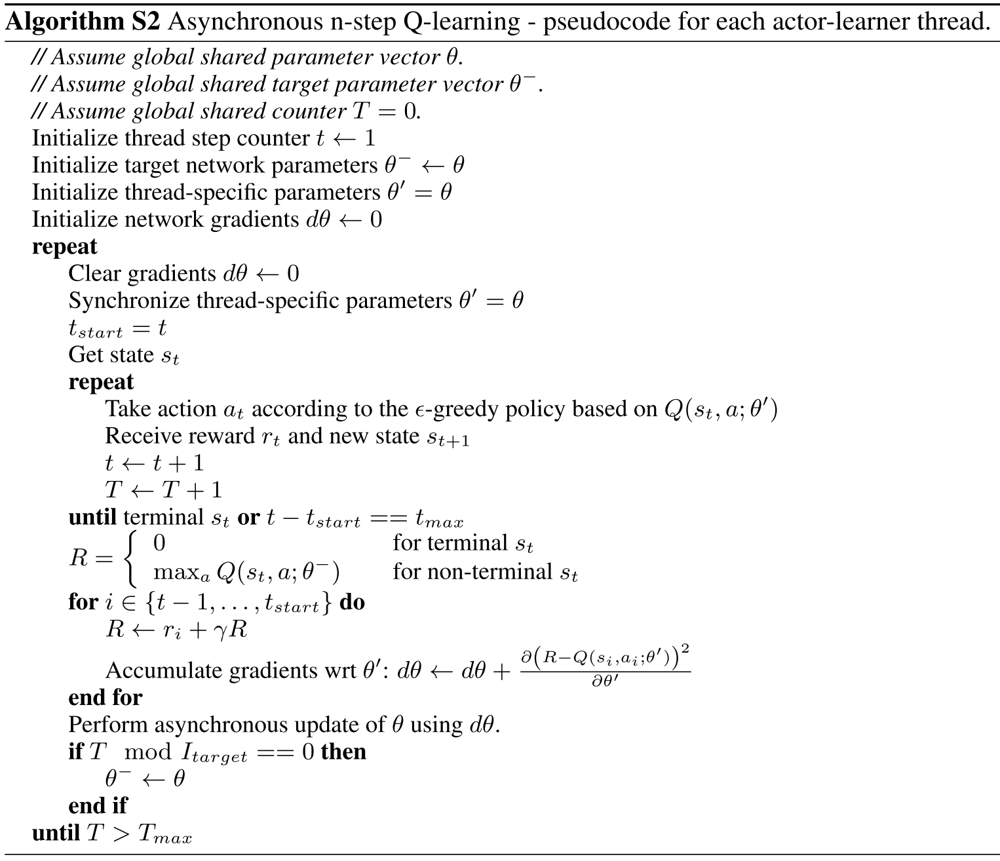

## Actor-Critic with Experience Replay (ACER)

Sample Efficient Actor-Critic with Experience Replay. [[arxiv '16]](http://arxiv.org/abs/1611.01224)

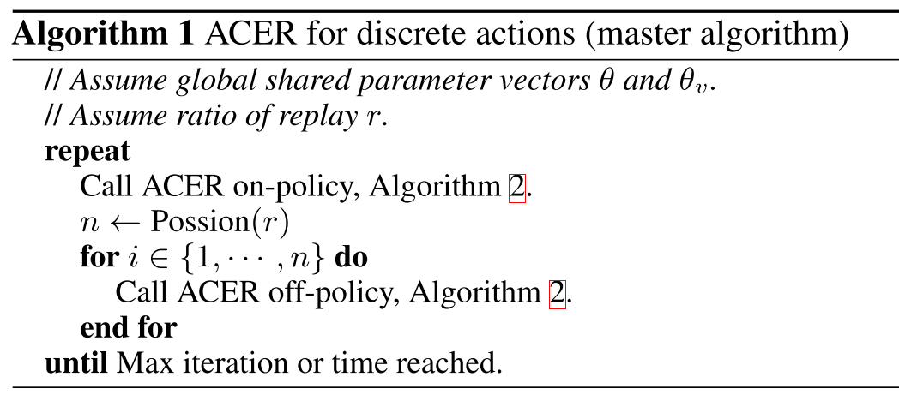

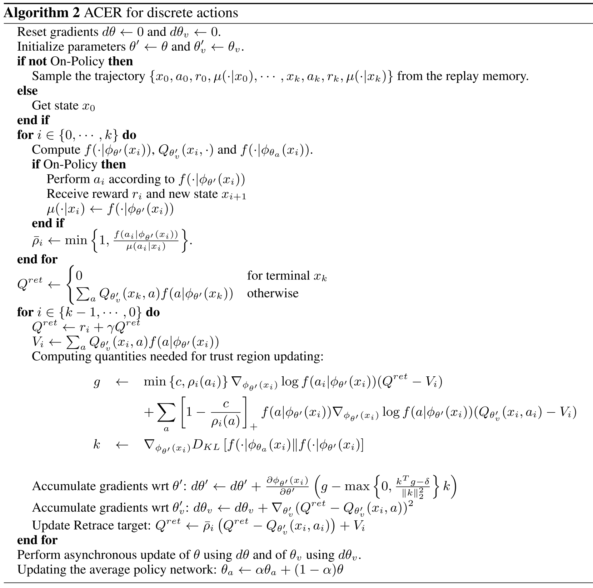

# DQN family

## Original

Human-level Control through Deep Reinforcement Learning. [[Nature '14]](http://www.nature.com/nature/journal/v518/n7540/abs/nature14236.html)

## Double DQN

Deep Reinforcement Learning with Double Q-learning. [[arxiv '15]](http://arxiv.org/abs/1509.06461)

The max operator in standard Q-learning and DQN uses the same values both to select and to evaluate an action. This makes it more likely to select overestimated values, resulting in overoptimistic value estimates. To prevent this, we can decouple the selection from the evaluation.

- Vanilla target: 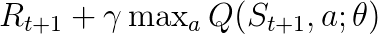
- Double DQN target: 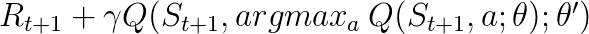

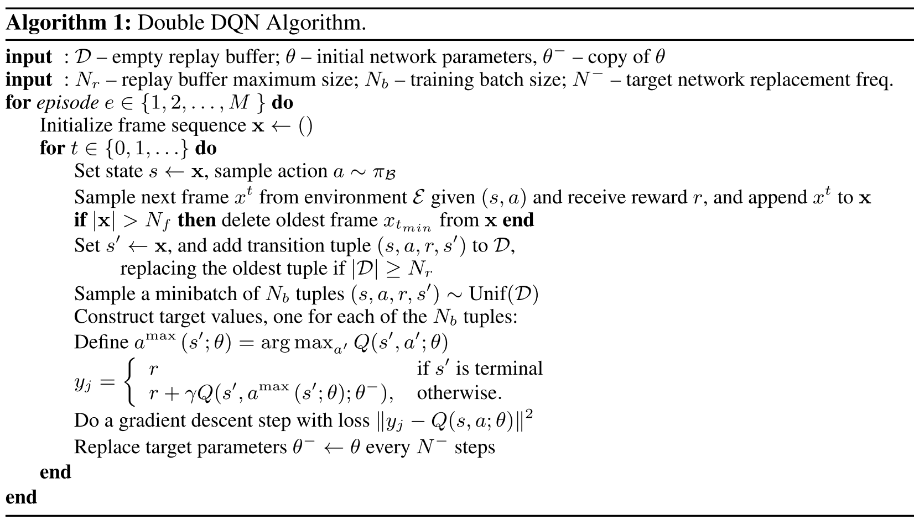

## Dueling DQN

Dueling Network Architectures for Deep Reinforcement Learning. [[arxiv '15]](http://arxiv.org/abs/1511.06581)

- Dueling network represents two separate estimators: one for the state value function and one for the state-dependent action advantage function.
- To address the issue of identifiability, we can force the advantage function estimator to have zero advantage at the chosen action. This can be achieved by subtracting either 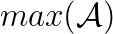 or average 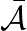 from the action value. The latter is better in practice.

Formula for the decomposition of Q-value:

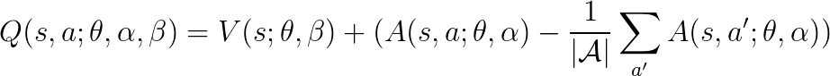

- 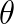 is shared parameter for the network.
-  parameterizes output stream for advantage function 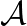. 
- 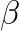 parameterizes output stream for value function _V_. 

## Prioritized Experience Replay

Prioritized Experience Replay. [[arxiv '15]](http://arxiv.org/abs/1511.05952)

We define the probability of sampling transition _i_ as 
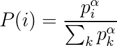 where  is the priority of each transition and exponent  determines how much prioritization is used. 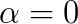 corresponds to uniform random sampling. 

Two variants of priority assignment:

1. Proportional to TD error:  where 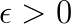 0"  height="12" /> ensures transitions with zero TD error will also be revisited.
2. Rank-based: 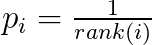 sorted with respect to TD error 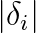. More robust. 

Tricks must be used to efficiently compute the above two priorities (i.e. does not increase by _O(N)_).

Importance-sampling weights 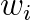 must be used to correct the bias introduced by prioritized replay:

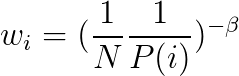

and linearly anneal  from 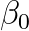 at the beginning of training to 1. 

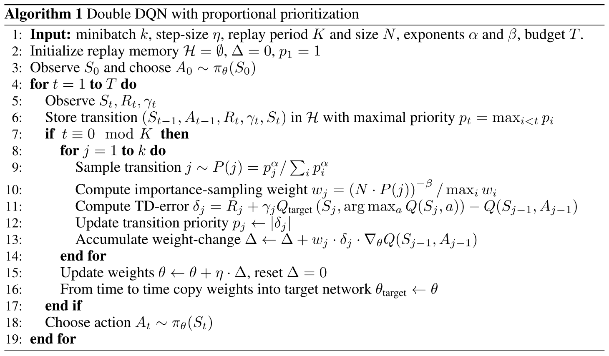

## Normalized Advantage Function (NAF)

Continuous Deep Q-Learning with Model-based Acceleration. [[arxiv '16]](http://arxiv.org/abs/1603.00748)

Formulate advantage function such that the maximum is trivial to find. 

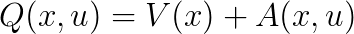

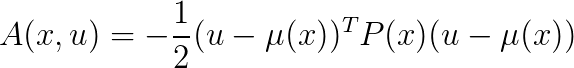

All the above functions _Q_, _V_, _A_, _P_ are parameterized. 

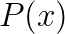 is a state-dependent, positive-definite square matrix where 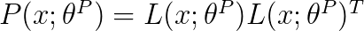 and 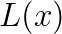 is a lower-triangular matrix whose entries come from a linear output layer of a neural network, with the diagonal terms exponentiated.

The action that maximizes _Q_ is always 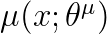.

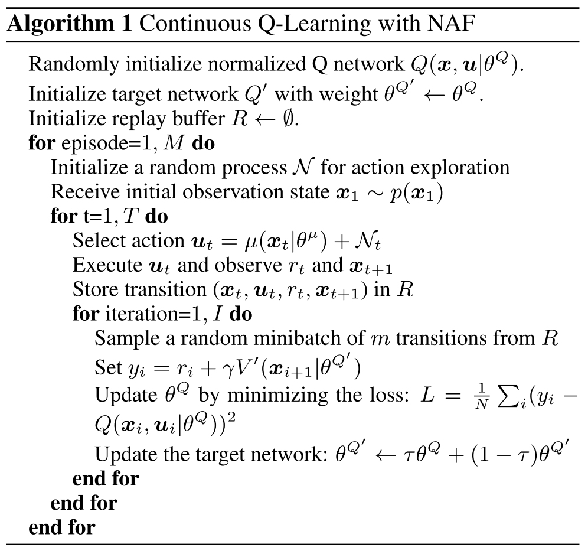

## Bootstrapped DQN

Deep Exploration via Bootstrapped DQN. [[arxiv '16]](http://arxiv.org/abs/1602.04621)

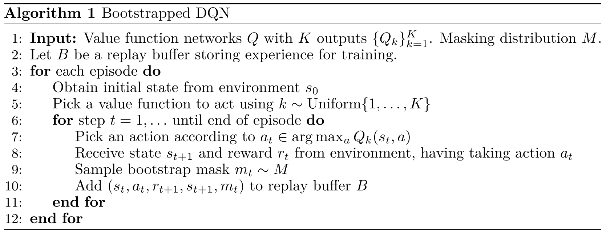
